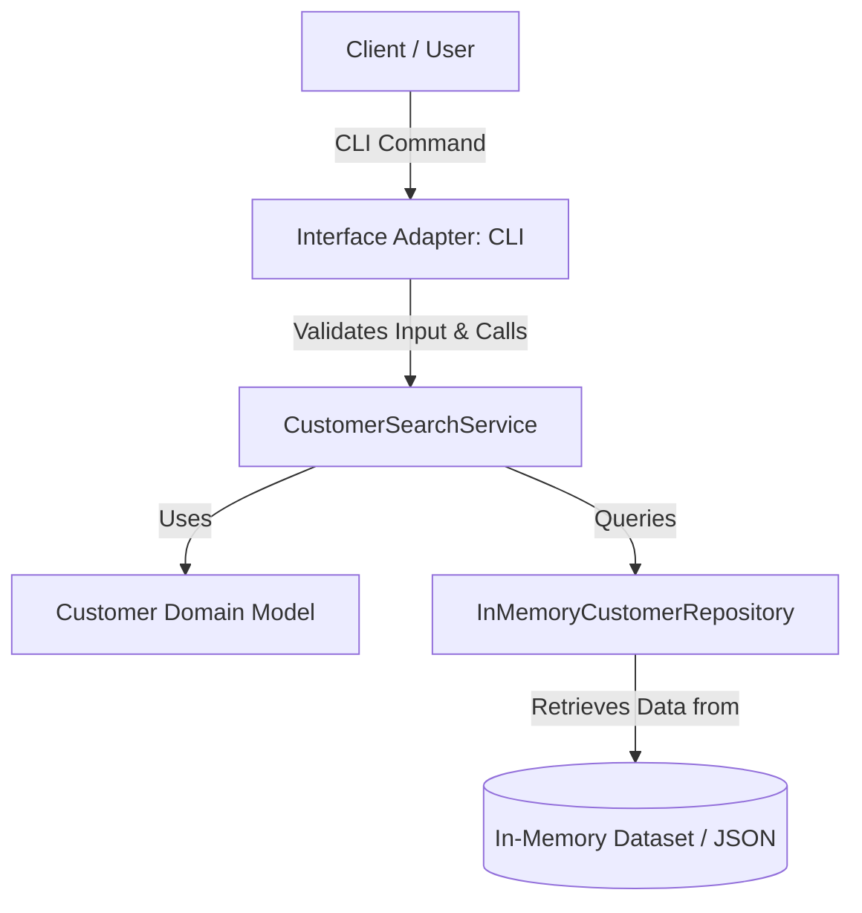

# Architecture

## Overview
The Customer Search application follows a clean, layered architecture (Ports and Adapters variant) that isolates core business logic from external interfaces (CLI). All data is stored and queried in-memory.

## Components 
1. Domain (domain/models.py): Holds pure data structures (Customer dataclass).
2. Repository (repository/customer_repository.py): Interface and implementation for in-memory customer data retrieval.
3. Service Layer (services/search_service.py): Contains core search algorithms, normalization, and business validation rules.
4. Interface Adapters (entrypoints/cli.py): Translates external inputs into domain queries.
 
## Responsibilities 
- Customer (Model): Defines data schema (id, name, email) and basic domain invariants.
- InMemoryCustomerRepository: Stores records in memory and provides read-only lookup operations.
- CustomerSearchService: Validates search inputs, normalizes queries, and filters repository data.
- CLI Entrypoint: Parses user arguments/requests, invokes the service, and outputs formatted results or errors.
 
## Data Flow 
1. Input Reception: User passes a search query string via CLI flag.
2. Request Handling: The interface layer captures the query string.
3. Service Execution: CustomerSearchService.search(query) is called.
4. Validation: Query is checked for length (>= 2 chars) and non-whitespace characters. Raises InvalidQueryError if invalid.
5. Normalization & Search: Query string is trimmed and converted to lower case. The service filters repository records where query is a substring of name.lower() or email.lower().
6. Response Mapping: Matched records are returned as a list of Customer objects and serialized for display/response.
 
## Interfaces 
- Service Interface (class CustomerSearchService): Validates query and performs case-insensitive partial match on name or email.
- Repository Interface (clas CustomerRepositoryProtocol): Returns all stored customer records.
 
## Error Handling 
* Domain/Service Exceptions:
    * InvalidQueryError: Custom exception raised when query validation fails.
* Interface Mapping:
    * CLI: Catches InvalidQueryError, prints standard error message to stderr, and exits with code 1.
 
## Testing Strategy 
* Unit Tests (tests/unit/):
    * Search logic (case sensitivity, partial matching, empty results).
    * Validation rules (too short, whitespace only, edge cases).
* Integration / End-to-End Tests (tests/integration/):
    * Execution via CLI to verify correct formatting.
* Coverage Goal: Minimum 90% line coverage using pytest and pytest-cov.

## Dependencies 
- Core Domain & Logic: Standard Python Library (dataclasses, typing, enum).
- Testing: pytest, pytest-cov.
 
## Design Decisions 
- In-Memory Storage: Chosen to fulfill requirements without external database setup overhead.
- Dataclasses for Models: Provides concise, typed, and clean data representations.
- Custom Exception Types: Decouples business validation failure logic from presentation layers.
 
## Trade-offs 
- Scalability vs Simplicity: Linear search (O(N)) across in-memory lists is extremely fast for small mock datasets (< 10,000 records), but would require indexing (e.g., Trie, inverted index) or database query optimization for large datasets.

- Static Seed Data: Hardcoded or JSON-loaded data avoids persistence logic complexity, but changes during runtime are lost on restart.